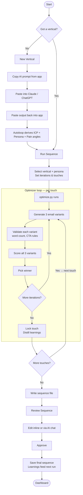

# Autoloop

Cold email sequence optimizer for Heymarket. Uses Claude AI to generate, score, and iteratively improve multi-touch outreach sequences for specific industry verticals and buyer personas.

---

## How it works

1. **Define a vertical** — describe an industry and buyer persona (e.g. healthcare / IT Director)
2. **Run the optimizer** — Claude generates 3 variants per email touch, scores them, picks the winner, and repeats across up to 8 touches
3. **Review and edit** — edit sequences inline or chat with the AI to refine them
4. **Approve** — lock the sequence and the learnings feed back into the next run



### The iterative loop

Each touch runs `iterations` generate+evaluate cycles — 2 API calls each. Claude generates 3 variants per cycle, scores them on 6 criteria, and picks the winner. After the last iteration, the winner's key patterns are distilled into compact learnings and injected into the next touch's context. This means every touch benefits from what worked in the previous one.

### Scoring criteria

Each touch is scored out of 60. Six criteria, each 1–10:

| Criterion | What it measures |
|---|---|
| **Hook** | Does the first line earn attention? |
| **Persona Relevance** | Does it speak to this buyer's specific pain? |
| **Proof** | Is there a concrete, cited stat or customer story? |
| **CTA Quality** | Is the ask one specific question, low-commitment? |
| **Brevity** | Is it under 100 words with no filler? |
| **Human Tone** | Does it sound like a person, not a vendor? |

Score color in the UI: **green ≥ 45**, **yellow ≥ 40**, **red < 40**.

### How feedback distillation works

After you approve a sequence in Review Sequence:
1. Autoloop diffs the original generated touches against your edits
2. Claude synthesizes 3–5 learning bullets per changed touch (what you kept, what you changed, why it likely works better)
3. These bullets are appended to `verticals/<vertical>/learnings/learnings_<persona>.md`
4. The next optimizer run loads these learnings and injects them into every generation prompt — your editorial judgment directly shapes future output

---

## Setup

**Requirements:** Python 3.11+

> **API Key Security:** `.env` is git-ignored. Before sharing this repo or deploying externally, rotate your key at [console.anthropic.com](https://console.anthropic.com).

```bash
pip install -r requirements.txt
```

Create a `.env` file in the project root (copy from `.env.example`):

```
ANTHROPIC_API_KEY=your-key-here
```

Run the app:

```bash
streamlit run streamlit_app.py
```

Opens at `http://localhost:8501`

---

## Pages

### Dashboard
Overview of all verticals and personas. Shows average sequence scores and which personas have sequences generated. Green = score ≥ 45, yellow = ≥ 40, red < 40.

### New Vertical

Two ways to add a new vertical:

**Option A — Recommended (AI-assisted derivation):**
1. Go to **New Vertical** in the app
2. Copy the prompt template shown on screen
3. Paste it into Claude.ai (or any capable AI) and fill in your industry details
4. Paste the AI's output back into the app
5. Click **Derive Vertical** — Autoloop calls `optimize.py --derive`, which writes:
   - `verticals/<name>/icp_<name>.md` — ideal customer profile
   - `verticals/<name>/personas/<persona>.md` — buyer persona
   - Appends a SEARCH SPACE block (8 pain angles) to `shared/program.md`
6. Review the derived files that appear on screen
7. Go to **Run Sequence** and select the new vertical

**Option B — Manual:** Create files in `verticals/<name>/` following the existing structure in any other vertical.

### Run Sequence
Pick a vertical and persona, set iterations (how many variants to test per touch) and number of touches (up to 8), then run. Streams live output as the optimizer runs.

**API cost:** `iterations × touches × 2` API calls. Example: 5 iterations × 8 touches = 80 calls (~$0.25–$0.40 at current Sonnet pricing). A full 8-touch run takes roughly 4 minutes.

### View Sequence
Read-only view of a generated sequence with per-touch scores and distilled learnings from past runs.

### Review Sequence
Edit sequences inline or use the AI chat panel to request changes (e.g. "make touch 3 shorter" or "swap the proof point in touch 5 for something from healthcare"). When satisfied, approve — this saves the final version and distills your edits into learnings for the next run.

- **Save draft** — syncs your edits back to the sequence file (reversible, shows in View Sequence)
- **Approve** — locks the sequence, writes `approved_<persona>.md`, and distills your changes into learnings

### Master Instructions
Edit the three shared knowledge files that inform every sequence:
- **Program** (`shared/program.md`) — sequence rules, scoring rubric, and pain angles per persona
- **Product Knowledge** (`shared/product_knowledge.md`) — Heymarket features, integrations, proof points
- **Proof Bank** (`shared/proof_bank.md`) — verified customer stats and quotes (cited verbatim in emails)

---

## Example output

Touch 1 and Touch 2 from an approved credit union / IT Director sequence:

```
TOUCH 1 — Day 1 — Cold intro | Score: 45/60
Subject: member communication compliance gaps

Hi {{first_name}},

When examiners audit member communications, can you produce complete records from
all channels? Most credit unions have loan officer texts on personal devices,
member service calls in one system, email follow-ups elsewhere.

Many organizations face similar scattered communication challenges. Unified
platforms create complete audit trails while maintaining proper business records
across all member touchpoints.

How do you currently track member communication compliance at {{company}}?

[SIGNATURE]

---

TOUCH 2 — Day 4 — Follow-up | Score: 48/60
Subject: your core system text integration

Hi {{first_name}},

Bet {{company}} runs member communications through multiple platforms. Core system
for accounts, separate tool for texts, maybe email through another vendor. Data
never syncs.

U-Haul faced identical integration chaos. Their fix: unified SMS platform that
plugs directly into Salesforce. "Heymarket's Salesforce SMS integration makes
messaging leads and customers a smooth experience for our agents."

One dashboard, complete member communication history, zero data silos.

How many different platforms do your staff use for member communications currently?

[SIGNATURE]
```

---

## File structure

```
streamlit_app.py          # main app
optimize.py               # sequence generation engine (called by the app)
scrape.py                 # scrapes heymarket.com to refresh product_knowledge.md
icp_template.md           # template for defining a new vertical

shared/
  program.md              # sequence rules + pain angles for each persona
  product_knowledge.md    # Heymarket product context
  proof_bank.md           # verified proof points (cite verbatim)

verticals/
  <vertical>/
    icp_<vertical>.md     # ideal customer profile
    personas/             # one .md file per buyer persona
    sequences/            # generated sequences (sequence_<persona>.md)
    learnings/            # distilled learnings from past runs
    logs/                 # full iteration logs
```

---

## Refreshing product knowledge

`scrape.py` scrapes heymarket.com and writes to `shared/product_knowledge.md`. Run it if the product knowledge feels stale:

```bash
python scrape.py
```

---

## Deployment

Single service, single port. No database, no Node, no separate frontend.

**Environment variable required:**
```
ANTHROPIC_API_KEY=<key>
```

**Start command** (handled automatically via `Procfile`):
```
streamlit run streamlit_app.py --server.address=0.0.0.0 --server.port=${PORT:-8501} --server.headless=true
```

**Important:** the app writes data to `verticals/` and `shared/` on disk. The deployment environment must have a **persistent volume** mounted at the project root — otherwise data is lost on restart.

---

## Troubleshooting

**`ERROR: ANTHROPIC_API_KEY not set`**
Check that `.env` exists in the project root and contains `ANTHROPIC_API_KEY=sk-ant-...`. If running in a deployment environment, set it as an environment variable directly.

**`Could not find SEARCH SPACE for persona`**
The persona slug passed to the optimizer must exactly match a SEARCH SPACE header in `shared/program.md`. If you added a new vertical via Option B (manual), make sure the header format matches: `SEARCH SPACE — <Persona Title> (<vertical>)`. Use Option A (AI-assisted derivation) to generate this automatically.

**`ERROR: Required file not found`**
Run the app from the project root directory, not a subdirectory. The optimizer resolves all paths relative to its own location.

**Blank or incomplete sequence after a run**
Check the full iteration log at `verticals/<vertical>/logs/log_<persona>_opener.md`. Look for repeated validation failures (word count exceeded, forbidden CTA phrases) — these may indicate the persona or program rules need adjustment.
